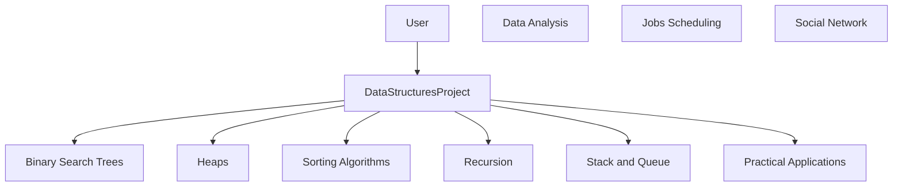

# Data Structures Projects
Python implementations of classic data structures and algorithms, organized by category with self-contained scripts and per-category readmes.

## Quick Start
```bash
# Quick start: No external dependencies. Requires Python 3.x
python3 --version

# Run a basic entry point (example)
python3 "Project-1/arrayoos.py"

# Explore a specific module (example BST operations)
python3 "Project-1/Binary search tree/bst_ops.py"

# You can execute any entry point similarly, e.g.:
# python3 "Project-1/Heaps/heapops.py"
# python3 "Project-1/Stack & queue/listasqueue.py"
```

## Architecture


## Tech Stack
- Python 3.x
- Python Standard Library (no external dependencies)

## Key Features
- Directory-based organization by DS/AL category for easy navigation
- Illustrative implementations for BSTs, heaps, sorting, recursion, stacks/queues, and more
- Self-contained scripts with readme docs per category for quick onboarding

If you’d like, I can tailor the quick-start commands to a subset of scripts you want to spotlight or add a minimal usage guide for each entry point.